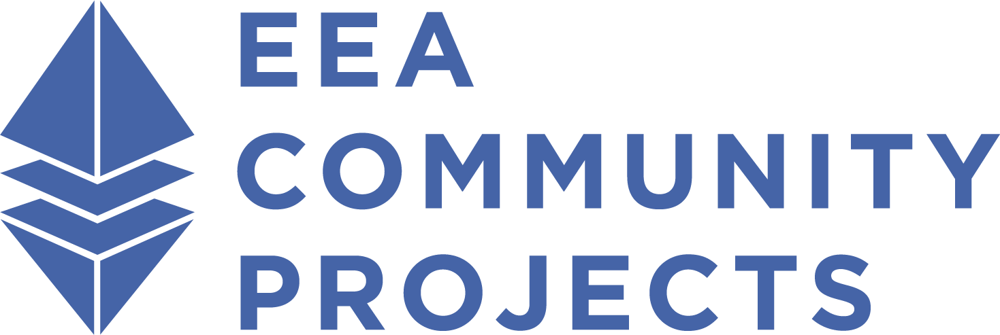

<h1>EEA Community Projects Governing Board (PGB)</H1>

The Project Governing Board sets overall strategic direction for the EEA Community Projects and formally approves released work products.

PGB members include representatives of [EEA Community Projects sponsor organizations](https://github.com/eea-oasis/managed-open-project/blob/main/SPONSORS.md) and representatives from the community at-large who serve on the Technical Steering Committee.

<i>PGB Chairs</i>: Daniel Burnett, Tas Dienes
 

PGB members:
 

<iframe src="https://docs.google.com/spreadsheets/d/e/2PACX-1vT38MUZFWO1ISzQWC6wSulN7IJCmYdSOIxBiofgO4c8mRF0hOuLEO59bW6McK2Lm0DgJkpaPLAf38AI/pubhtml?gid=463834327&amp;single=true&amp;widget=true&amp;headers=false" style="border-style: none; width: 450px; height: 500px" title="EEA Community Projects Project Governing Board members"></iframe>

For information on sponsoring these projects or joining the governing board, please contact <a href="mailto:communications@oasis-open.org">communications@oasis-open.org</a>.

